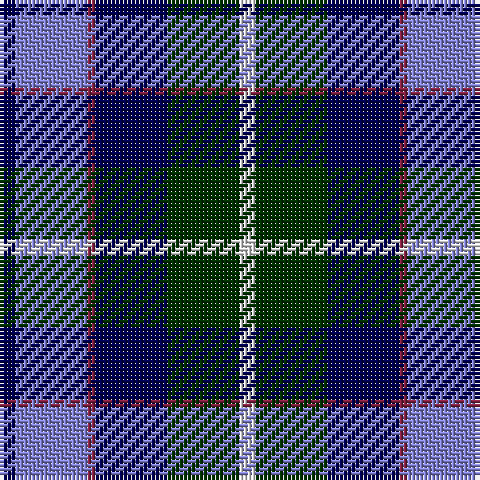

The parent of this is [American Express](/tartans/db/4/b18/dr2/db18/dg18/ln/4/)

This was sourced from weddslist.  It is a [6 stripes tartan](/stripes/stripes6/).

Original link http://www.weddslist.com/cgi-bin/tartans/pg.pl?source=sts

## Thread count
DB/4 B18 DR2 DB18 DG18 LN/4

## Palette
Each colour and its ΔE from the base-6 reference it is a variant of.

| Colour | Shade | Base | ΔE (OKLab) |
|---|---|---|---|
| B |  `#8080D0` | B  | 0.24 |
| DB |  `#000050` | B  | 0.20 |
| DG |  `#003000` | G  | 0.18 |
| DR |  `#802040` | R  | 0.16 |
| LN |  `#E0E0E0` | W  | 0.06 |

# Sample pattern

ID: /variants/db/4/b18/dr2/db18/dg18/ln/4-b8080d0-db000050-dg003000-dr802040-lne0e0e0/
