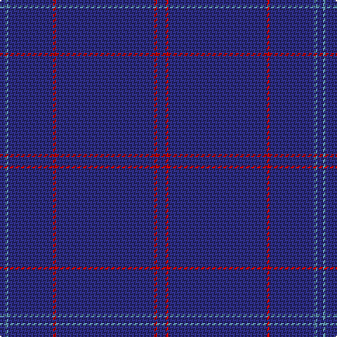

The parent of this is [Lochaber Old.. District Tartan Tartan Number: 33. Earliest known date: 1797 J.Telfer Dunbar Collection. Lochaber is the home of Clan Cameron and a portion of the Clanranald MacDonalds. The former military Fort William is now the population centre of the district on the West coast of Scotland. This is one of several recorded old authentic patterns from the Lochaber district. See products available Copyright © Blair Urquhart, Comrie, 2015](/tartans/db/4/b2/db32/r2/db70/r2/db/6/)

This was sourced from house-of-tartan.  It is a [7 stripes tartan](/stripes/stripes7/).

Original link http://www.house-of-tartan.scotland.net/house/TartanViewjs.asp?colr=Def&tnam=33

## Thread count
DB/4 B2 DB32 R2 DB70 R2 DB/6

## Palette
Each colour and its ΔE from the base-6 reference it is a variant of.

| Colour | Shade | Base | ΔE (OKLab) |
|---|---|---|---|
| B |  `#5C8CA8` | B  | 0.23 |
| DB |  `#2C2C80` | B  | 0.05 |
| R |  `#C80000` | R  | 0.00 |

# Sample pattern

ID: /variants/db/4/b2/db32/r2/db70/r2/db/6-b5c8ca8-db2c2c80-rc80000/
