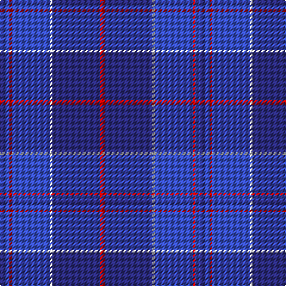

The parent of this is [British American School of Charlotte](/tartans/db/4/b4/r2/b32/ln2/db40/r/4/)

This was sourced from register-of-tartans.  It is a [7 stripes tartan](/stripes/stripes7/).

Original link https://www.tartanregister.gov.uk/tartanDetails.aspx?ref=5510

## Thread count
DB/4 B4 R2 B32 LN2 DB40 R/4

## Palette
Each colour and its ΔE from the base-6 reference it is a variant of.

| Colour | Shade | Base | ΔE (OKLab) |
|---|---|---|---|
| B |  `#3850C8` | B  | 0.12 |
| DB |  `#2C2C80` | B  | 0.05 |
| DBa |  `#202060` | B  | 0.11 |
| G |  `#006818` | G  | 0.02 |
| K |  `#101010` | K  | 0.17 |
| LN |  `#E0E0E0` | W  | 0.06 |
| N |  `#C0C0C0` | W  | 0.16 |
| R |  `#C80000` | R  | 0.00 |

# Sample pattern

ID: /variants/db/4/b4/r2/b32/ln2/db40/r/4-b3850c8-db2c2c80-dba202060-g006818-k101010-lne0e0e0-nc0c0c0-rc80000/
