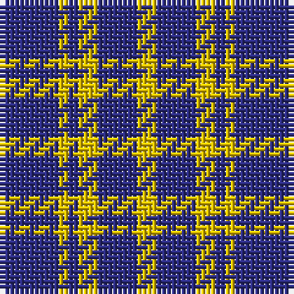

The parent of this is [Creek Indian Nation (District)](/tartans/db/4/dba8/y2/db2/ya4/dba8/ya/4/)

This was sourced from tartans-authority.  It is a [7 stripes tartan](/stripes/stripes7/).

Original link http://www.tartansauthority.com/tartan-ferret/display/4610/

## Thread count
DB/4 DBa8 Y2 DB2 Ya4 DBa8 Ya/4

## Palette
Each colour and its ΔE from the base-6 reference it is a variant of.

| Colour | Shade | Base | ΔE (OKLab) |
|---|---|---|---|
| DB |  `#2C2C80` | B  | 0.05 |
| DBa |  `#2C2C80` | B  | 0.05 |
| Y |  `#E8C000` | Y  | 0.00 |
| Ya |  `#E8C000` | Y  | 0.00 |

# Sample pattern

ID: /variants/db/4/dba8/y2/db2/ya4/dba8/ya/4-db2c2c80-dba2c2c80-ye8c000-yae8c000/
