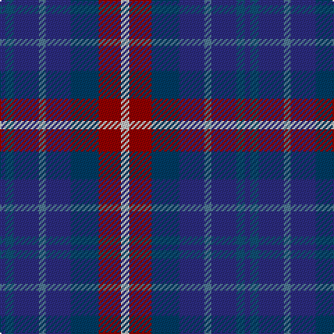

The parent of this is [Queen of the South F.C. (Sports)](/tartans/db/4/dbb6/db18/b5/db18/dba20/dr16/n/6/)

This was sourced from tartans-authority.  It is a [8 stripes tartan](/stripes/stripes8/).

Original link http://www.tartansauthority.com/tartan-ferret/display/2649/

## Thread count
DB/4 DBb6 DB18 B5 DB18 DBa20 DR16 N/6

## Palette
Each colour and its ΔE from the base-6 reference it is a variant of.

| Colour | Shade | Base | ΔE (OKLab) |
|---|---|---|---|
| B |  `#507894` | B  | 0.17 |
| DB |  `#2C2C80` | B  | 0.05 |
| DBa |  `#003C64` | B  | 0.07 |
| DBb |  `#105074` | B  | 0.06 |
| DR |  `#940000` | R  | 0.11 |
| N |  `#C4C4C4` | W  | 0.15 |

# Sample pattern

ID: /variants/db/4/dbb6/db18/b5/db18/dba20/dr16/n/6-b507894-db2c2c80-dba003c64-dbb105074-dr940000-nc4c4c4/
