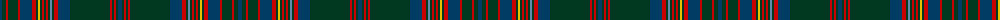

The parent of this is [Ettrick (Green) District Tartan Tartan Number: 2300. Earliest known date: 1971 Ettrick District is in the Borders of Scotland. See products available Copyright © Blair Urquhart, Comrie, 2015](/tartans/db/4/dg4/r2/dg10/r2/db12/r4/dg2/y2/dg2/r2/dg2/r2/dg2/b2/dg2/r4/db12/dg40/r2/dg2/r2/dg2/db/4/)

This was sourced from house-of-tartan.  It is a [24 stripes tartan](/stripes/stripes24/).

Original link http://www.house-of-tartan.scotland.net/house/TartanViewjs.asp?colr=Def&tnam=2300

## Thread count
DB/4 DG4 R2 DG10 R2 DB12 R4 DG2 Y2 DG2 R2 DG2 R2 DG2 B2 DG2 R4 DB12 DG40 R2 DG2 R2 DG2 DB/4

## Palette
Each colour and its ΔE from the base-6 reference it is a variant of.

| Colour | Shade | Base | ΔE (OKLab) |
|---|---|---|---|
| B |  `#5C8CA8` | B  | 0.23 |
| DB |  `#003C64` | B  | 0.07 |
| DG |  `#003820` | G  | 0.16 |
| R |  `#C80000` | R  | 0.00 |
| Y |  `#E8C000` | Y  | 0.00 |

ID: /variants/db/4/dg4/r2/dg10/r2/db12/r4/dg2/y2/dg2/r2/dg2/r2/dg2/b2/dg2/r4/db12/dg40/r2/dg2/r2/dg2/db/4-b5c8ca8-db003c64-dg003820-rc80000-ye8c000/
