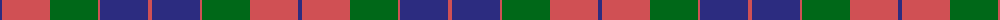

The parent of this is [Mar, Red](/tartans/db/4/do48/g48/do2/db48/do/4/)

This was sourced from tartans-authority.  It is a [6 stripes tartan](/stripes/stripes6/).

Original link http://www.tartansauthority.com/tartan-ferret/display/529/

## Thread count
DB/4 DO48 G48 DO2 DB48 DO/4

## Palette
Each colour and its ΔE from the base-6 reference it is a variant of.

| Colour | Shade | Base | ΔE (OKLab) |
|---|---|---|---|
| DB |  `#2C2C80` | B  | 0.05 |
| DO |  `#D05054` | R  | 0.10 |
| G |  `#006818` | G  | 0.02 |

# Sample pattern

ID: /variants/db/4/do48/g48/do2/db48/do/4-db2c2c80-dod05054-g006818/
