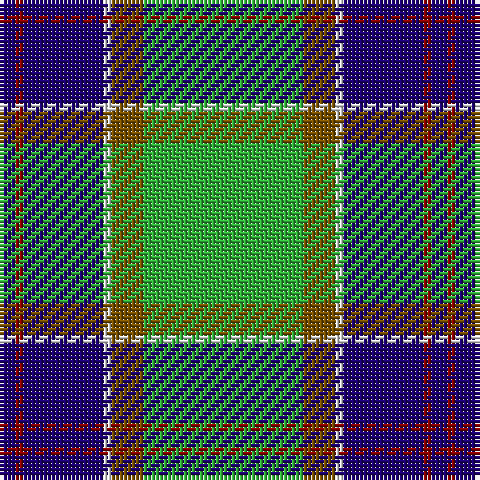

The parent of this is [Ayrshire](/tartans/db/4/dr2/db20/ln2/t8/g16/g2/g/4/)

This was sourced from register-of-tartans.  It is a [8 stripes tartan](/stripes/stripes8/).

Original link https://www.tartanregister.gov.uk/tartanDetails.aspx?ref=151

## Thread count
DB/4 DR2 DB20 LN2 T8 G16 G2 G/4

## Palette
Each colour and its ΔE from the base-6 reference it is a variant of.

| Colour | Shade | Base | ΔE (OKLab) |
|---|---|---|---|
| DB |  `#1C0070` | B  | 0.14 |
| DR |  `#880000` | R  | 0.14 |
| DY |  `#BC8C00` | Y  | 0.16 |
| G |  `#30AC38` | G  | 0.22 |
| LN |  `#E0E0E0` | W  | 0.06 |
| T |  `#785000` | G  | 0.14 |

# Sample pattern

ID: /variants/db/4/dr2/db20/ln2/t8/g16/g2/g/4-db1c0070-dr880000-dybc8c00-g30ac38-lne0e0e0-t785000/
