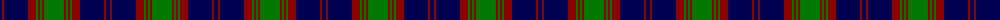

The parent of this is [Unidentified Portrait](/tartans/db/4/dr2/db24/dr8/g2/dr2/g2/dr2/g/20/)

This was sourced from register-of-tartans.  It is a [9 stripes tartan](/stripes/stripes9/).

Original link https://www.tartanregister.gov.uk/tartanDetails.aspx?ref=4358

## Thread count
DB/4 DR2 DB24 DR8 G2 DR2 G2 DR2 G/20

## Palette
Each colour and its ΔE from the base-6 reference it is a variant of.

| Colour | Shade | Base | ΔE (OKLab) |
|---|---|---|---|
| B |  `#788CB4` | B  | 0.25 |
| DB |  `#000050` | B  | 0.20 |
| DR |  `#8C0000` | R  | 0.13 |
| DY |  `#C88C00` | Y  | 0.15 |
| G |  `#007800` | G  | 0.06 |
| K |  `#000000` | K  | 0.00 |
| N |  `#C8C8C8` | W  | 0.13 |
| P |  `#64008C` | B  | 0.13 |

ID: /variants/db/4/dr2/db24/dr8/g2/dr2/g2/dr2/g/20-b788cb4-db000050-dr8c0000-dyc88c00-g007800-k000000-nc8c8c8-p64008c/
