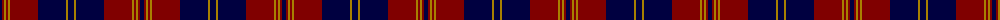

The parent of this is [Breckon (Name)](/tartans/db/4/dr2/dy2/dr2/dy2/dr28/db28/dy2/db/6/)

This was sourced from tartans-authority.  It is a [9 stripes tartan](/stripes/stripes9/).

Original link http://www.tartansauthority.com/tartan-ferret/display/7908/

## Thread count
DB/4 DR2 DY2 DR2 DY2 DR28 DB28 DY2 DB/6

## Palette
Each colour and its ΔE from the base-6 reference it is a variant of.

| Colour | Shade | Base | ΔE (OKLab) |
|---|---|---|---|
| DB |  `#000040` | K  | 0.20 |
| DR |  `#800000` | R  | 0.16 |
| DY |  `#A88000` | Y  | 0.20 |

ID: /variants/db/4/dr2/dy2/dr2/dy2/dr28/db28/dy2/db/6-db000040-dr800000-dya88000/
