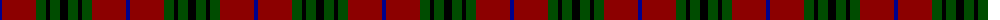

The parent of this is [Denny Htg (Clan)](/tartans/db/4/dr34/g10/k4/g10/k/8/)

This was sourced from tartans-authority.  It is a [6 stripes tartan](/stripes/stripes6/).

Original link http://www.tartansauthority.com/tartan-ferret/display/518/

## Thread count
DB/4 DR34 G10 K4 G10 K/8

## Palette
Each colour and its ΔE from the base-6 reference it is a variant of.

| Colour | Shade | Base | ΔE (OKLab) |
|---|---|---|---|
| DB |  `#00008C` | B  | 0.13 |
| DR |  `#8C0000` | R  | 0.13 |
| G |  `#004C00` | G  | 0.08 |
| K |  `#000000` | K  | 0.00 |

# Sample pattern

ID: /variants/db/4/dr34/g10/k4/g10/k/8-db00008c-dr8c0000-g004c00-k000000/
