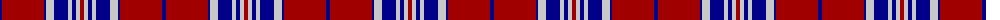

The parent of this is [American (Fashion))](/tartans/db/4/dr42/db2/n8/db14/n4/db4/n4/dr/4/)

This was sourced from tartans-authority.  It is a [9 stripes tartan](/stripes/stripes9/).

Original link http://www.tartansauthority.com/tartan-ferret/display/464/

## Thread count
DB/4 DR42 DB2 N8 DB14 N4 DB4 N4 DR/4

## Palette
Each colour and its ΔE from the base-6 reference it is a variant of.

| Colour | Shade | Base | ΔE (OKLab) |
|---|---|---|---|
| DB |  `#000088` | B  | 0.14 |
| DR |  `#A00000` | R  | 0.09 |
| N |  `#C8C8C8` | W  | 0.13 |

ID: /variants/db/4/dr42/db2/n8/db14/n4/db4/n4/dr/4-db000088-dra00000-nc8c8c8/
