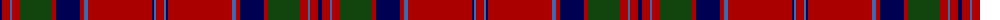

The parent of this is [MacGillivray](/tartans/db/4/dr8/b2/dr8/dg32/dr4/db24/dr4/b4/dr64/db2/b2/dr/8/)

This was sourced from weddslist.  It is a [13 stripes tartan](/stripes/stripes13/).

Original link http://www.weddslist.com/cgi-bin/tartans/pg.pl?source=x

## Thread count
DB/4 DR8 B2 DR8 DG32 DR4 DB24 DR4 B4 DR64 DB2 B2 DR/8

## Palette
Each colour and its ΔE from the base-6 reference it is a variant of.

| Colour | Shade | Base | ΔE (OKLab) |
|---|---|---|---|
| B |  `#4367AE` | B  | 0.13 |
| DB |  `#000052` | B  | 0.20 |
| DG |  `#11450D` | G  | 0.10 |
| DR |  `#AA0000` | R  | 0.06 |

ID: /variants/db/4/dr8/b2/dr8/dg32/dr4/db24/dr4/b4/dr64/db2/b2/dr/8-b4367ae-db000052-dg11450d-draa0000/
