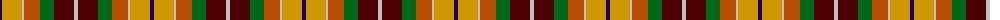
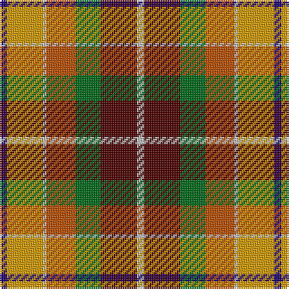

The parent of this is [Kipp (Personal)](/tartans/db/4/dy20/n2/do16/g14/dr20/n/4/)

This was sourced from tartans-authority.  It is a [7 stripes tartan](/stripes/stripes7/).

Original link http://www.tartansauthority.com/tartan-ferret/display/2445/

## Thread count
DB/4 DY20 N2 DO16 G14 DR20 N/4

## Palette
Each colour and its ΔE from the base-6 reference it is a variant of.

| Colour | Shade | Base | ΔE (OKLab) |
|---|---|---|---|
| DB |  `#1C0070` | B  | 0.14 |
| DO |  `#B84C00` | R  | 0.08 |
| DR |  `#4C0000` | B  | 0.24 |
| DY |  `#D09800` | Y  | 0.11 |
| G |  `#006818` | G  | 0.02 |
| N |  `#C0C0C0` | W  | 0.16 |

# Sample pattern

ID: /variants/db/4/dy20/n2/do16/g14/dr20/n/4-db1c0070-dob84c00-dr4c0000-dyd09800-g006818-nc0c0c0/
