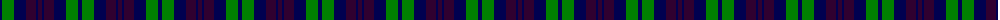
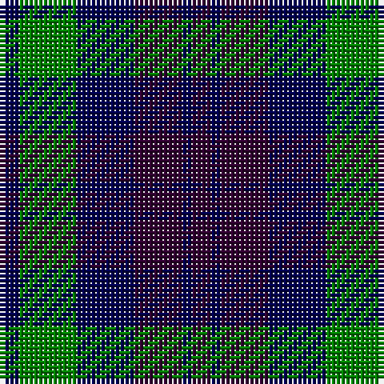

The parent of this is [Unnamed, No 54](/tartans/db/4/g12/db12/dp10/db2/dp/4/)

This was sourced from weddslist.  It is a [6 stripes tartan](/stripes/stripes6/).

Original link http://www.weddslist.com/cgi-bin/tartans/pg.pl?source=sts

## Thread count
DB/4 G12 DB12 DP10 DB2 DP/4

## Palette
Each colour and its ΔE from the base-6 reference it is a variant of.

| Colour | Shade | Base | ΔE (OKLab) |
|---|---|---|---|
| DB |  `#000050` | B  | 0.20 |
| DP |  `#300030` | B  | 0.21 |
| G |  `#008000` | G  | 0.09 |

# Sample pattern

ID: /variants/db/4/g12/db12/dp10/db2/dp/4-db000050-dp300030-g008000/
