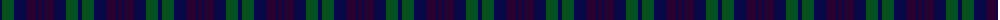

The parent of this is [Unidentified no. 54](/tartans/db/4/g12/db12/dp10/db2/dp/4/)

This was sourced from register-of-tartans.  It is a [6 stripes tartan](/stripes/stripes6/).

Original link https://www.tartanregister.gov.uk/tartanDetails.aspx?ref=4334

## Thread count
DB/4 G12 DB12 DP10 DB2 DP/4

## Palette
Each colour and its ΔE from the base-6 reference it is a variant of.

| Colour | Shade | Base | ΔE (OKLab) |
|---|---|---|---|
| DB |  `#080848` | B  | 0.19 |
| DP |  `#280032` | B  | 0.21 |
| G |  `#005020` | G  | 0.08 |

# Sample pattern

ID: /variants/db/4/g12/db12/dp10/db2/dp/4-db080848-dp280032-g005020/
