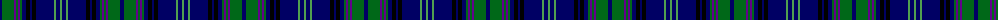

The parent of this is [Lochcarron of Scotland (Corporate)](/tartans/db/4/g12/p2/g2/p2/g2/db4/k4/db2/k4/db18/lg2/db4/lg/2/)

This was sourced from tartans-authority.  It is a [14 stripes tartan](/stripes/stripes14/).

Original link http://www.tartansauthority.com/tartan-ferret/display/5466/

## Thread count
DB/4 G12 P2 G2 P2 G2 DB4 K4 DB2 K4 DB18 LG2 DB4 LG/2

## Palette
Each colour and its ΔE from the base-6 reference it is a variant of.

| Colour | Shade | Base | ΔE (OKLab) |
|---|---|---|---|
| DB |  `#000064` | B  | 0.17 |
| G |  `#006818` | G  | 0.02 |
| K |  `#000000` | K  | 0.00 |
| LG |  `#50A050` | G  | 0.20 |
| P |  `#64008C` | B  | 0.13 |

ID: /variants/db/4/g12/p2/g2/p2/g2/db4/k4/db2/k4/db18/lg2/db4/lg/2-db000064-g006818-k000000-lg50a050-p64008c/
