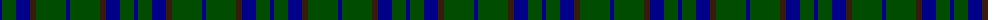
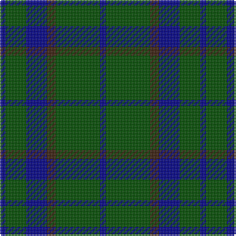

The parent of this is [Green Highland, The](/tartans/db/4/g14/db14/k6/g30/db/4/)

This was sourced from register-of-tartans.  It is a [6 stripes tartan](/stripes/stripes6/).

Original link https://www.tartanregister.gov.uk/tartanDetails.aspx?ref=1523

## Thread count
DB/4 G14 DB14 K6 G30 DB/4

## Palette
Each colour and its ΔE from the base-6 reference it is a variant of.

| Colour | Shade | Base | ΔE (OKLab) |
|---|---|---|---|
| DB |  `#000088` | B  | 0.14 |
| G |  `#004C00` | G  | 0.08 |
| Ga |  `#004800` | G  | 0.09 |
| K |  `#381C0C` | B  | 0.21 |

# Sample pattern

ID: /variants/db/4/g14/db14/k6/g30/db/4-db000088-g004c00-ga004800-k381c0c/
