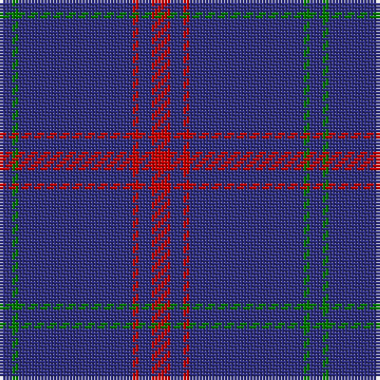

The parent of this is [Lynch](/tartans/db/4/g2/db36/r2/db4/r/6/)

This was sourced from register-of-tartans.  It is a [6 stripes tartan](/stripes/stripes6/).

Original link https://www.tartanregister.gov.uk/tartanDetails.aspx?ref=2253

## Thread count
DB/4 G2 DB36 R2 DB4 R/6

## Palette
Each colour and its ΔE from the base-6 reference it is a variant of.

| Colour | Shade | Base | ΔE (OKLab) |
|---|---|---|---|
| DB |  `#2C2C80` | B  | 0.05 |
| G |  `#007C00` | G  | 0.08 |
| R |  `#C80000` | R  | 0.00 |

# Sample pattern

ID: /variants/db/4/g2/db36/r2/db4/r/6-db2c2c80-g007c00-rc80000/
