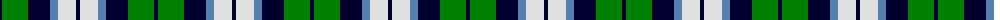

The parent of this is [Loch Leven, Check](/tartans/db/4/g26/db22/b8/ln18/db/4/)

This was sourced from weddslist.  It is a [6 stripes tartan](/stripes/stripes6/).

Original link http://www.weddslist.com/cgi-bin/tartans/pg.pl?source=sts

## Thread count
DB/4 G26 DB22 B8 LN18 DB/4

## Palette
Each colour and its ΔE from the base-6 reference it is a variant of.

| Colour | Shade | Base | ΔE (OKLab) |
|---|---|---|---|
| B |  `#5480B0` | B  | 0.20 |
| DB |  `#000030` | K  | 0.17 |
| G |  `#008000` | G  | 0.09 |
| LN |  `#E0E0E0` | W  | 0.06 |

# Sample pattern

ID: /variants/db/4/g26/db22/b8/ln18/db/4-b5480b0-db000030-g008000-lne0e0e0/
