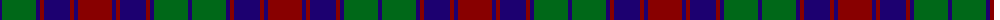

The parent of this is [Red Remony (Fashion)](/tartans/db/4/g34/db4/dr4/db26/dr4/db4/dr/34/)

This was sourced from tartans-authority.  It is a [8 stripes tartan](/stripes/stripes8/).

Original link http://www.tartansauthority.com/tartan-ferret/display/2235/

## Thread count
DB/4 G34 DB4 DR4 DB26 DR4 DB4 DR/34

## Palette
Each colour and its ΔE from the base-6 reference it is a variant of.

| Colour | Shade | Base | ΔE (OKLab) |
|---|---|---|---|
| DB |  `#1C0070` | B  | 0.14 |
| DR |  `#880000` | R  | 0.14 |
| G |  `#006818` | G  | 0.02 |

# Sample pattern

ID: /variants/db/4/g34/db4/dr4/db26/dr4/db4/dr/34-db1c0070-dr880000-g006818/
