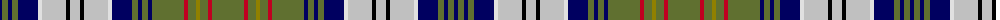

The parent of this is [O'Sullivan, McCragh](/tartans/db/4/g6/db4/g6/db20/ln4/n24/k4/n10/k4/n24/ln4/db20/g6/db4/g6/db4/g32/r4/g8/lg4/g8/r4/g/32/)

This was sourced from weddslist.  It is a [24 stripes tartan](/stripes/stripes24/).

Original link http://www.weddslist.com/cgi-bin/tartans/pg.pl?source=sts

## Thread count
DB/4 G6 DB4 G6 DB20 LN4 N24 K4 N10 K4 N24 LN4 DB20 G6 DB4 G6 DB4 G32 R4 G8 LG4 G8 R4 G/32

## Palette
Each colour and its ΔE from the base-6 reference it is a variant of.

| Colour | Shade | Base | ΔE (OKLab) |
|---|---|---|---|
| DB |  `#000060` | B  | 0.18 |
| G |  `#607030` | G  | 0.11 |
| K |  `#000000` | K  | 0.00 |
| LG |  `#908000` | G  | 0.19 |
| LN |  `#E0E0E0` | W  | 0.06 |
| N |  `#C0C0C0` | W  | 0.16 |
| R |  `#C00020` | R  | 0.02 |

ID: /variants/db/4/g6/db4/g6/db20/ln4/n24/k4/n10/k4/n24/ln4/db20/g6/db4/g6/db4/g32/r4/g8/lg4/g8/r4/g/32-db000060-g607030-k000000-lg908000-lne0e0e0-nc0c0c0-rc00020/
