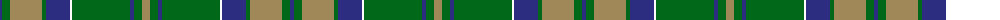

The parent of this is [Unidentified (Pahls)](/tartans/db/4/g8/lt32/g4/db24/w2/g58/db4/g8/lt/8/)

This was sourced from tartans-authority.  It is a [10 stripes tartan](/stripes/stripes10/).

Original link http://www.tartansauthority.com/tartan-ferret/display/8574/

## Thread count
DB/4 G8 LT32 G4 DB24 W2 G58 DB4 G8 LT/8

## Palette
Each colour and its ΔE from the base-6 reference it is a variant of.

| Colour | Shade | Base | ΔE (OKLab) |
|---|---|---|---|
| DB |  `#2C2C80` | B  | 0.05 |
| G |  `#006818` | G  | 0.02 |
| LT |  `#A08858` | Y  | 0.21 |
| W |  `#FCFCFC` | W  | 0.03 |

ID: /variants/db/4/g8/lt32/g4/db24/w2/g58/db4/g8/lt/8-db2c2c80-g006818-lta08858-wfcfcfc/
