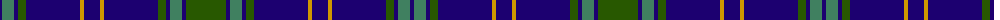

The parent of this is [Kinross](/tartans/db/4/ga12/db4/g8/db54/dy4/db16/dy4/db54/g8/db4/ga12/db4/g/40/)

This was sourced from register-of-tartans.  It is a [14 stripes tartan](/stripes/stripes14/).

Original link https://www.tartanregister.gov.uk/tartanDetails.aspx?ref=1997

## Thread count
DB/4 Ga12 DB4 G8 DB54 DY4 DB16 DY4 DB54 G8 DB4 Ga12 DB4 G/40

## Palette
Each colour and its ΔE from the base-6 reference it is a variant of.

| Colour | Shade | Base | ΔE (OKLab) |
|---|---|---|---|
| DB |  `#1C0070` | B  | 0.14 |
| DY |  `#D09800` | Y  | 0.11 |
| G |  `#285800` | G  | 0.04 |
| Ga |  `#408060` | G  | 0.13 |

ID: /variants/db/4/ga12/db4/g8/db54/dy4/db16/dy4/db54/g8/db4/ga12/db4/g/40-db1c0070-dyd09800-g285800-ga408060/
