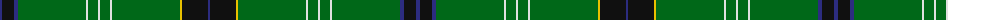

The parent of this is [Stirling Castle (Corporate)](/tartans/db/4/k12/db4/g68/ln2/g10/ln2/g10/ln2/g68/y2/k26/db/2/)

This was sourced from tartans-authority.  It is a [13 stripes tartan](/stripes/stripes13/).

Original link http://www.tartansauthority.com/tartan-ferret/display/8116/

## Thread count
DB/4 K12 DB4 G68 LN2 G10 LN2 G10 LN2 G68 Y2 K26 DB/2

## Palette
Each colour and its ΔE from the base-6 reference it is a variant of.

| Colour | Shade | Base | ΔE (OKLab) |
|---|---|---|---|
| DB |  `#2C2C80` | B  | 0.05 |
| G |  `#006818` | G  | 0.02 |
| K |  `#101010` | K  | 0.17 |
| LN |  `#E0E0E0` | W  | 0.06 |
| Y |  `#E8C000` | Y  | 0.00 |

ID: /variants/db/4/k12/db4/g68/ln2/g10/ln2/g10/ln2/g68/y2/k26/db/2-db2c2c80-g006818-k101010-lne0e0e0-ye8c000/
