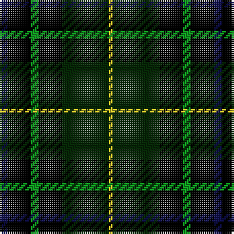

The parent of this is [Leahy, Thomas Francis & Mary (Australia)](/tartans/db/4/k12/g4/k12/dg24/y/2/)

This was sourced from register-of-tartans.  It is a [6 stripes tartan](/stripes/stripes6/).

Original link https://www.tartanregister.gov.uk/tartanDetails.aspx?ref=10308

## Thread count
DB/4 K12 G4 K12 DG24 Y/2

## Palette
Each colour and its ΔE from the base-6 reference it is a variant of.

| Colour | Shade | Base | ΔE (OKLab) |
|---|---|---|---|
| DB |  `#0D0D4B` | B  | 0.18 |
| DG |  `#062706` | G  | 0.21 |
| G |  `#109920` | G  | 0.16 |
| K |  `#000000` | K  | 0.00 |
| Y |  `#D3C229` | Y  | 0.03 |

# Sample pattern

ID: /variants/db/4/k12/g4/k12/dg24/y/2-db0d0d4b-dg062706-g109920-k000000-yd3c229/
