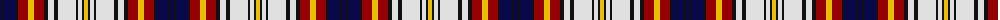

The parent of this is [Unidentified #11](/tartans/db/4/k2/db12/k2/dr10/y6/dr10/k4/ln6/k4/ln18/k2/ln4/k2/y/4/)

This was sourced from register-of-tartans.  It is a [15 stripes tartan](/stripes/stripes15/).

Original link https://www.tartanregister.gov.uk/tartanDetails.aspx?ref=4212

## Thread count
DB/4 K2 DB12 K2 DR10 Y6 DR10 K4 LN6 K4 LN18 K2 LN4 K2 Y/4

## Palette
Each colour and its ΔE from the base-6 reference it is a variant of.

| Colour | Shade | Base | ΔE (OKLab) |
|---|---|---|---|
| DB |  `#080848` | B  | 0.19 |
| DR |  `#960000` | R  | 0.11 |
| K |  `#101010` | K  | 0.17 |
| LN |  `#E0E0E0` | W  | 0.06 |
| Y |  `#E8C000` | Y  | 0.00 |

ID: /variants/db/4/k2/db12/k2/dr10/y6/dr10/k4/ln6/k4/ln18/k2/ln4/k2/y/4-db080848-dr960000-k101010-lne0e0e0-ye8c000/
