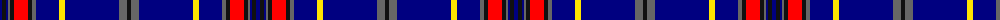

The parent of this is [Blue Brough from Orkney](/tartans/db/4/k4/db2/n2/k4/r14/k4/n4/db23/y6/db54/n8/k/4/)

This was sourced from register-of-tartans.  It is a [13 stripes tartan](/stripes/stripes13/).

Original link https://www.tartanregister.gov.uk/tartanDetails.aspx?ref=10463

## Thread count
DB/4 K4 DB2 N2 K4 R14 K4 N4 DB23 Y6 DB54 N8 K/4

## Palette
Each colour and its ΔE from the base-6 reference it is a variant of.

| Colour | Shade | Base | ΔE (OKLab) |
|---|---|---|---|
| DB |  `#000080` | B  | 0.14 |
| K |  `#101010` | K  | 0.17 |
| N |  `#666666` | B  | 0.16 |
| R |  `#FF0000` | R  | 0.11 |
| Y |  `#FFE600` | Y  | 0.10 |

ID: /variants/db/4/k4/db2/n2/k4/r14/k4/n4/db23/y6/db54/n8/k/4-db000080-k101010-n666666-rff0000-yffe600/
