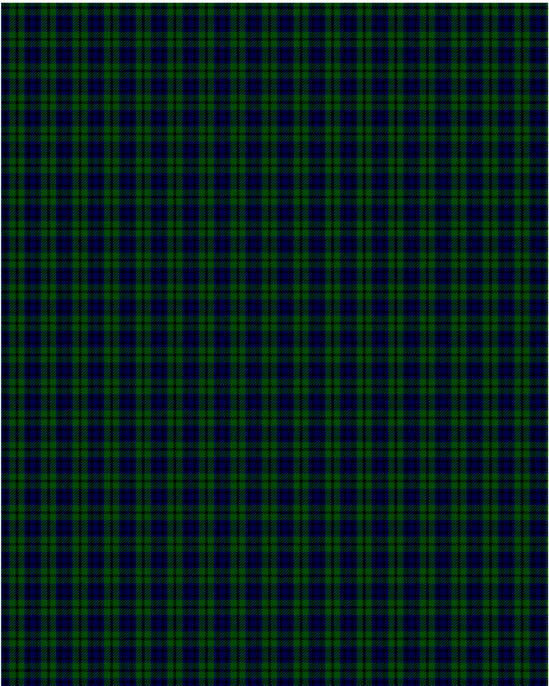

The parent of this is [Austin](/tartans/db/4/k4/db4/g9/k/2/)

This was sourced from <no value>.  It is a [5 stripes tartan](/stripes/stripes5/).

Original link http://www.weddslist.com/cgi-bin/tartans/pg.pl?source=rb

## Thread count
DB/4 K4 DB4 G9 K/2

## Palette
DB G K

# Sample pattern

ID: /variants/db/4/k4/db4/g9/k/2-db00004c-g004c00-k000000/