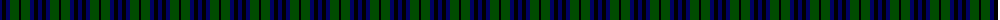
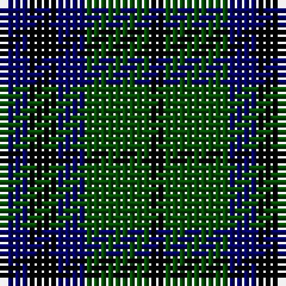

The parent of this is [Keith and Austin](/tartans/db/4/k4/db4/g9/k/2/)

This was sourced from weddslist.  It is a [5 stripes tartan](/stripes/stripes5/).

Original link http://www.weddslist.com/cgi-bin/tartans/pg.pl?source=rb

## Thread count
DB/4 K4 DB4 G9 K/2

## Palette
Each colour and its ΔE from the base-6 reference it is a variant of.

| Colour | Shade | Base | ΔE (OKLab) |
|---|---|---|---|
| DB |  `#000064` | B  | 0.17 |
| G |  `#004C00` | G  | 0.08 |
| K |  `#000000` | K  | 0.00 |

# Sample pattern

ID: /variants/db/4/k4/db4/g9/k/2-db000064-g004c00-k000000/
