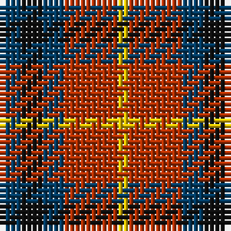

The parent of this is [Chivas Regal (Corporate)](/tartans/db/4/k4/db4/r10/y/2/)

This was sourced from tartans-authority.  It is a [5 stripes tartan](/stripes/stripes5/).

Original link http://www.tartansauthority.com/tartan-ferret/display/3949/

## Thread count
DB/4 K4 DB4 R10 Y/2

## Palette
Each colour and its ΔE from the base-6 reference it is a variant of.

| Colour | Shade | Base | ΔE (OKLab) |
|---|---|---|---|
| DB |  `#003C64` | B  | 0.07 |
| K |  `#101010` | K  | 0.17 |
| R |  `#B03000` | R  | 0.05 |
| Y |  `#E8C000` | Y  | 0.00 |

# Sample pattern

ID: /variants/db/4/k4/db4/r10/y/2-db003c64-k101010-rb03000-ye8c000/
