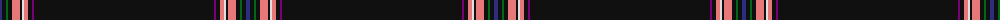

The parent of this is [CoVASS (Corporate)](/tartans/db/4/k4/g2/k4/lr8/k2/ln2/lr4/k4/p2/k/180/)

This was sourced from tartans-authority.  It is a [11 stripes tartan](/stripes/stripes11/).

Original link http://www.tartansauthority.com/tartan-ferret/display/7737/

## Thread count
DB/4 K4 G2 K4 LR8 K2 LN2 LR4 K4 P2 K/180

## Palette
Each colour and its ΔE from the base-6 reference it is a variant of.

| Colour | Shade | Base | ΔE (OKLab) |
|---|---|---|---|
| DB |  `#2C2C80` | B  | 0.05 |
| G |  `#006818` | G  | 0.02 |
| K |  `#101010` | K  | 0.17 |
| LN |  `#E0E0E0` | W  | 0.06 |
| LR |  `#E87878` | R  | 0.19 |
| P |  `#780078` | B  | 0.16 |

ID: /variants/db/4/k4/g2/k4/lr8/k2/ln2/lr4/k4/p2/k/180-db2c2c80-g006818-k101010-lne0e0e0-lre87878-p780078/
