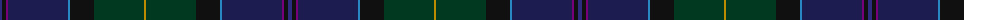

The parent of this is [Castellari of Lochaber Lairds (Pers](/tartans/db/4/k4/p2/dba60/b2/k24/dg50/dy/2/)

This was sourced from tartans-authority.  It is a [8 stripes tartan](/stripes/stripes8/).

Original link http://www.tartansauthority.com/tartan-ferret/display/7972/

## Thread count
DB/4 K4 P2 DBa60 B2 K24 DG50 DY/2

## Palette
Each colour and its ΔE from the base-6 reference it is a variant of.

| Colour | Shade | Base | ΔE (OKLab) |
|---|---|---|---|
| B |  `#2888C4` | B  | 0.21 |
| DB |  `#2C2C80` | B  | 0.05 |
| DBa |  `#1C1C50` | B  | 0.14 |
| DG |  `#003820` | G  | 0.16 |
| DY |  `#BC8C00` | Y  | 0.16 |
| K |  `#101010` | K  | 0.17 |
| P |  `#780078` | B  | 0.16 |

# Sample pattern

ID: /variants/db/4/k4/p2/dba60/b2/k24/dg50/dy/2-b2888c4-db2c2c80-dba1c1c50-dg003820-dybc8c00-k101010-p780078/
