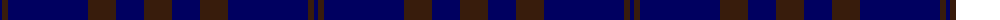

The parent of this is [Atlin](/tartans/db/4/k6/db80/k28/db28/k/28/)

This was sourced from register-of-tartans.  It is a [6 stripes tartan](/stripes/stripes6/).

Original link https://www.tartanregister.gov.uk/tartanDetails.aspx?ref=4962

## Thread count
DB/4 K6 DB80 K28 DB28 K/28

## Palette
Each colour and its ΔE from the base-6 reference it is a variant of.

| Colour | Shade | Base | ΔE (OKLab) |
|---|---|---|---|
| DB |  `#000060` | B  | 0.18 |
| K |  `#381C0C` | B  | 0.21 |

# Sample pattern

ID: /variants/db/4/k6/db80/k28/db28/k/28-db000060-k381c0c/
