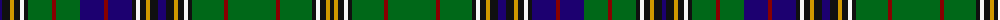

The parent of this is [Hawick](/tartans/db/4/k8/dy4/k6/w4/k4/g24/dr4/g24/db24/dr4/db24/k4/w4/k6/dy4/k8/db8/k8/dy4/k6/w4/k4/g32/dr4/g48/dr4/g32/k4/w4/k6/dy4/k/4/)

This was sourced from register-of-tartans.  It is a [33 stripes tartan](/stripes/stripes33/).

Original link https://www.tartanregister.gov.uk/tartanDetails.aspx?ref=1627

## Thread count
DB/4 K8 DY4 K6 W4 K4 G24 DR4 G24 DB24 DR4 DB24 K4 W4 K6 DY4 K8 DB8 K8 DY4 K6 W4 K4 G32 DR4 G48 DR4 G32 K4 W4 K6 DY4 K/4

## Palette
Each colour and its ΔE from the base-6 reference it is a variant of.

| Colour | Shade | Base | ΔE (OKLab) |
|---|---|---|---|
| DB |  `#1C0070` | B  | 0.14 |
| DR |  `#880000` | R  | 0.14 |
| DY |  `#D09800` | Y  | 0.11 |
| G |  `#006818` | G  | 0.02 |
| K |  `#101010` | K  | 0.17 |
| N |  `#C0C0C0` | W  | 0.16 |
| W |  `#F8F8F8` | W  | 0.01 |

ID: /variants/db/4/k8/dy4/k6/w4/k4/g24/dr4/g24/db24/dr4/db24/k4/w4/k6/dy4/k8/db8/k8/dy4/k6/w4/k4/g32/dr4/g48/dr4/g32/k4/w4/k6/dy4/k/4-db1c0070-dr880000-dyd09800-g006818-k101010-nc0c0c0-wf8f8f8/
