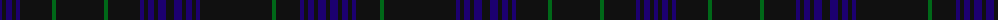

The parent of this is [Hawick Dress (District)](/tartans/db/4/kc4/db6/k4/db4/kb32/g4/k48/g4/kb32/db4/k4/db6/kc4/db8/ka8/db8/kc4/db6/k4/db4/ka24/k24/k24/g4/kb24/db4/k4/db6/kc4/db8/ka/4/)

This was sourced from tartans-authority.  It is a [32 stripes tartan](/stripes/stripes32/).

Original link http://www.tartansauthority.com/tartan-ferret/display/2409/

## Thread count
DB/4 Kc4 DB6 K4 DB4 Kb32 G4 K48 G4 Kb32 DB4 K4 DB6 Kc4 DB8 Ka8 DB8 Kc4 DB6 K4 DB4 Ka24 K24 K24 G4 Kb24 DB4 K4 DB6 Kc4 DB8 Ka/4

## Palette
Each colour and its ΔE from the base-6 reference it is a variant of.

| Colour | Shade | Base | ΔE (OKLab) |
|---|---|---|---|
| DB |  `#1C0070` | B  | 0.14 |
| G |  `#006818` | G  | 0.02 |
| K |  `#101010` | K  | 0.17 |
| Ka |  `#101010` | K  | 0.17 |
| Kb |  `#101010` | K  | 0.17 |
| Kc |  `#101010` | K  | 0.17 |

ID: /variants/db/4/kc4/db6/k4/db4/kb32/g4/k48/g4/kb32/db4/k4/db6/kc4/db8/ka8/db8/kc4/db6/k4/db4/ka24/k24/k24/g4/kb24/db4/k4/db6/kc4/db8/ka/4-db1c0070-g006818-k101010-ka101010-kb101010-kc101010/
