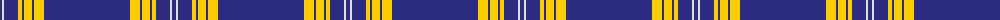

The parent of this is [University of Delaware (Corporate)](/tartans/db/4/ln2/db14/y4/db2/y8/db2/y10/db/86/)

This was sourced from tartans-authority.  It is a [9 stripes tartan](/stripes/stripes9/).

Original link http://www.tartansauthority.com/tartan-ferret/display/10518/

## Thread count
DB/4 LN2 DB14 Y4 DB2 Y8 DB2 Y10 DB/86

## Palette
Each colour and its ΔE from the base-6 reference it is a variant of.

| Colour | Shade | Base | ΔE (OKLab) |
|---|---|---|---|
| DB |  `#2C2C80` | B  | 0.05 |
| LN |  `#E0E0E0` | W  | 0.06 |
| Y |  `#FCCC00` | Y  | 0.04 |

ID: /variants/db/4/ln2/db14/y4/db2/y8/db2/y10/db/86-db2c2c80-lne0e0e0-yfccc00/
