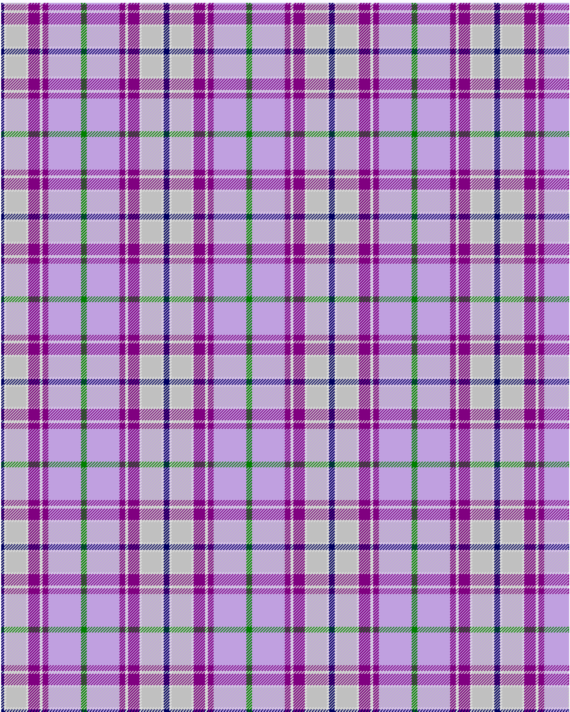

Heather, (R.S.S.P.C.C.)

This was sourced from <no value>.  It is a 9 stripes tartan.

Original link http://www.weddslist.com/cgi-bin/tartans/pg.pl?source=sts

## Thread count
DB/4 LN3 N28 LN3 P16 LN4 P8 LP46 G/4

## Palette
DB#000060 G#008000 LN#E0E0E0 LP#C0A0E0 N#C0C0C0 P#800080

# Sample pattern

ID: /variants/db/4/ln3/n28/ln3/p16/ln4/p8/lp46/g/4-db000060-g008000-lne0e0e0-lpc0a0e0-nc0c0c0-p800080