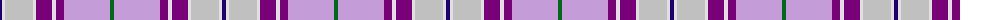

The parent of this is [Heather (R.S.S.P.C.C.) Corporate Tartan Tartan Number: 2108. Earliest known date: 1990 The design 'Heather Tartan' has been produced at the request of the Royal Society for Prevention of Cruelty to Children, as the Society's corporate tartan. The colours of the design are taken from the Society's badge and lettrhead. Dark Pink Mix, Light Pink Mix, Kingfisher and Emerald. See products available Copyright © Blair Urquhart, Comrie, 2015](/tartans/db/4/ln3/n28/ln3/p16/ln4/p8/lp46/g/4/)

This was sourced from house-of-tartan.  It is a [9 stripes tartan](/stripes/stripes9/).

Original link http://www.house-of-tartan.scotland.net/house/TartanViewjs.asp?colr=Def&tnam=2108

## Thread count
DB/4 LN3 N28 LN3 P16 LN4 P8 LP46 G/4

## Palette
Each colour and its ΔE from the base-6 reference it is a variant of.

| Colour | Shade | Base | ΔE (OKLab) |
|---|---|---|---|
| DB |  `#1C0070` | B  | 0.14 |
| G |  `#006818` | G  | 0.02 |
| LN |  `#E0E0E0` | W  | 0.06 |
| LP |  `#C49CD8` | W  | 0.24 |
| N |  `#C0C0C0` | W  | 0.16 |
| P |  `#780078` | B  | 0.16 |

ID: /variants/db/4/ln3/n28/ln3/p16/ln4/p8/lp46/g/4-db1c0070-g006818-lne0e0e0-lpc49cd8-nc0c0c0-p780078/
