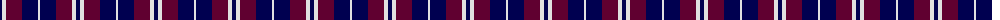
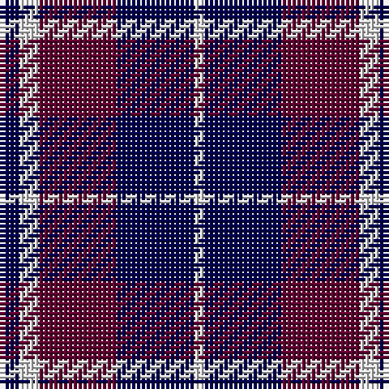

The parent of this is [Laval (Tartan de..)](/tartans/db/4/ln4/dr16/db16/ln/2/)

This was sourced from weddslist.  It is a [5 stripes tartan](/stripes/stripes5/).

Original link http://www.weddslist.com/cgi-bin/tartans/pg.pl?source=sts

## Thread count
DB/4 LN4 DR16 DB16 LN/2

## Palette
Each colour and its ΔE from the base-6 reference it is a variant of.

| Colour | Shade | Base | ΔE (OKLab) |
|---|---|---|---|
| DB |  `#000050` | B  | 0.20 |
| DR |  `#600030` | B  | 0.19 |
| LN |  `#E0E0E0` | W  | 0.06 |

# Sample pattern

ID: /variants/db/4/ln4/dr16/db16/ln/2-db000050-dr600030-lne0e0e0/
