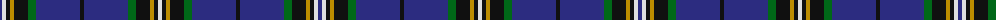

The parent of this is [Glasgow, University of Corporate Tartan Tartan Number: 2680. Earliest known date: 2002 The official livery and promotional university tartan (STS). See products available Copyright © Blair Urquhart, Comrie, 2015](/tartans/db/4/ln4/k4/dy4/k14/g8/db44/k4/db44/g8/k14/dy4/k4/ln/4/)

This was sourced from house-of-tartan.  It is a [14 stripes tartan](/stripes/stripes14/).

Original link http://www.house-of-tartan.scotland.net/house/TartanViewjs.asp?colr=Def&tnam=2680

## Thread count
DB/4 LN4 K4 DY4 K14 G8 DB44 K4 DB44 G8 K14 DY4 K4 LN/4

## Palette
Each colour and its ΔE from the base-6 reference it is a variant of.

| Colour | Shade | Base | ΔE (OKLab) |
|---|---|---|---|
| DB |  `#2C2C80` | B  | 0.05 |
| DY |  `#BC8C00` | Y  | 0.16 |
| G |  `#006818` | G  | 0.02 |
| K |  `#101010` | K  | 0.17 |
| LN |  `#E0E0E0` | W  | 0.06 |

ID: /variants/db/4/ln4/k4/dy4/k14/g8/db44/k4/db44/g8/k14/dy4/k4/ln/4-db2c2c80-dybc8c00-g006818-k101010-lne0e0e0/
