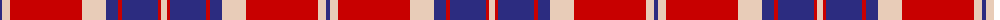

The parent of this is [Snoozzzeee (Corporate)](/tartans/db/4/lr8/r72/lr24/db12/r4/db36/r3/lr/6/)

This was sourced from tartans-authority.  It is a [9 stripes tartan](/stripes/stripes9/).

Original link http://www.tartansauthority.com/tartan-ferret/display/6102/

## Thread count
DB/4 LR8 R72 LR24 DB12 R4 DB36 R3 LR/6

## Palette
Each colour and its ΔE from the base-6 reference it is a variant of.

| Colour | Shade | Base | ΔE (OKLab) |
|---|---|---|---|
| DB |  `#2C2C80` | B  | 0.05 |
| LR |  `#E8CCB8` | W  | 0.11 |
| R |  `#C80000` | R  | 0.00 |

ID: /variants/db/4/lr8/r72/lr24/db12/r4/db36/r3/lr/6-db2c2c80-lre8ccb8-rc80000/
