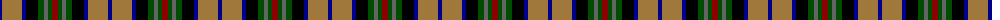

The parent of this is [Burnfoot Check (Fashion)](/tartans/db/4/lt20/db4/k12/g6/n4/g4/dr/6/)

This was sourced from tartans-authority.  It is a [8 stripes tartan](/stripes/stripes8/).

Original link http://www.tartansauthority.com/tartan-ferret/display/3773/

## Thread count
DB/4 LT20 DB4 K12 G6 N4 G4 DR/6

## Palette
Each colour and its ΔE from the base-6 reference it is a variant of.

| Colour | Shade | Base | ΔE (OKLab) |
|---|---|---|---|
| DB |  `#00008C` | B  | 0.13 |
| DR |  `#8C0000` | R  | 0.13 |
| G |  `#004C00` | G  | 0.08 |
| K |  `#000000` | K  | 0.00 |
| LT |  `#A0783C` | R  | 0.18 |
| N |  `#646464` | B  | 0.16 |

# Sample pattern

ID: /variants/db/4/lt20/db4/k12/g6/n4/g4/dr/6-db00008c-dr8c0000-g004c00-k000000-lta0783c-n646464/
