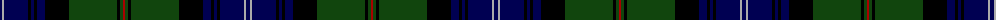

The parent of this is [Urquhart](/tartans/db/4/n2/db24/k3/db3/k3/db8/k24/dg48/k3/dg3/dr/2/)

This was sourced from weddslist.  It is a [12 stripes tartan](/stripes/stripes12/).

Original link http://www.weddslist.com/cgi-bin/tartans/pg.pl?source=x

## Thread count
DB/4 N2 DB24 K3 DB3 K3 DB8 K24 DG48 K3 DG3 DR/2

## Palette
Each colour and its ΔE from the base-6 reference it is a variant of.

| Colour | Shade | Base | ΔE (OKLab) |
|---|---|---|---|
| DB |  `#000052` | B  | 0.20 |
| DG |  `#11450D` | G  | 0.10 |
| DR |  `#AA0000` | R  | 0.06 |
| K |  `#000000` | K  | 0.00 |
| N |  `#AAAAAA` | Y  | 0.19 |

ID: /variants/db/4/n2/db24/k3/db3/k3/db8/k24/dg48/k3/dg3/dr/2-db000052-dg11450d-draa0000-k000000-naaaaaa/
