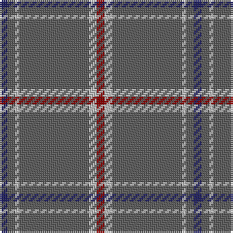

The parent of this is [St. Giles Cathedral (Corporate)](/tartans/db/4/n4/na2/n36/na4/dr/4/)

This was sourced from tartans-authority.  It is a [6 stripes tartan](/stripes/stripes6/).

Original link http://www.tartansauthority.com/tartan-ferret/display/3220/

## Thread count
DB/4 N4 Na2 N36 Na4 DR/4

## Palette
Each colour and its ΔE from the base-6 reference it is a variant of.

| Colour | Shade | Base | ΔE (OKLab) |
|---|---|---|---|
| DB |  `#202060` | B  | 0.11 |
| DR |  `#880000` | R  | 0.14 |
| N |  `#5C5C5C` | B  | 0.14 |
| Na |  `#C0C0C0` | W  | 0.16 |

# Sample pattern

ID: /variants/db/4/n4/na2/n36/na4/dr/4-db202060-dr880000-n5c5c5c-nac0c0c0/
