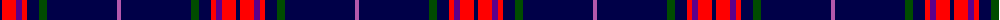

The parent of this is [Loretto School](/tartans/db/4/r14/p6/r5/db12/g8/db70/pa/4/)

This was sourced from register-of-tartans.  It is a [8 stripes tartan](/stripes/stripes8/).

Original link https://www.tartanregister.gov.uk/tartanDetails.aspx?ref=11334

## Thread count
DB/4 R14 P6 R5 DB12 G8 DB70 Pa/4

## Palette
Each colour and its ΔE from the base-6 reference it is a variant of.

| Colour | Shade | Base | ΔE (OKLab) |
|---|---|---|---|
| DB |  `#000048` | B  | 0.21 |
| G |  `#004C00` | G  | 0.08 |
| P |  `#5A008C` | B  | 0.12 |
| Pa |  `#B458AC` | R  | 0.20 |
| R |  `#FF0000` | R  | 0.11 |

# Sample pattern

ID: /variants/db/4/r14/p6/r5/db12/g8/db70/pa/4-db000048-g004c00-p5a008c-pab458ac-rff0000/
