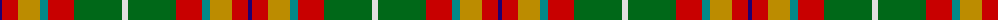

The parent of this is [Elystan Glodrydd (Name)](/tartans/db/4/r16/dy22/b8/r26/g48/ln/6/)

This was sourced from tartans-authority.  It is a [7 stripes tartan](/stripes/stripes7/).

Original link http://www.tartansauthority.com/tartan-ferret/display/8556/

## Thread count
DB/4 R16 DY22 B8 R26 G48 LN/6

## Palette
Each colour and its ΔE from the base-6 reference it is a variant of.

| Colour | Shade | Base | ΔE (OKLab) |
|---|---|---|---|
| B |  `#048888` | G  | 0.18 |
| DB |  `#1C0070` | B  | 0.14 |
| DY |  `#BC8C00` | Y  | 0.16 |
| G |  `#006818` | G  | 0.02 |
| LN |  `#E0E0E0` | W  | 0.06 |
| R |  `#C80000` | R  | 0.00 |

# Sample pattern

ID: /variants/db/4/r16/dy22/b8/r26/g48/ln/6-b048888-db1c0070-dybc8c00-g006818-lne0e0e0-rc80000/
