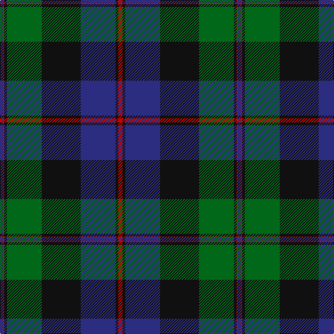

The parent of this is [Common Kilt Tartan Tartan Number: 554. Earliest known date: c. 1790 A version of the Blatck Watch tartan produced by Wilson's of Bannockburn before the widespread use of clan names for tartan. The military Black Watch tartan was also woven with a red stripe. See products available Copyright © Blair Urquhart, Comrie, 2015](/tartans/db/4/r2/k4/g50/k56/db50/k4/r/6/)

This was sourced from house-of-tartan.  It is a [8 stripes tartan](/stripes/stripes8/).

Original link http://www.house-of-tartan.scotland.net/house/TartanViewjs.asp?colr=Def&tnam=554

## Thread count
DB/4 R2 K4 G50 K56 DB50 K4 R/6

## Palette
Each colour and its ΔE from the base-6 reference it is a variant of.

| Colour | Shade | Base | ΔE (OKLab) |
|---|---|---|---|
| DB |  `#2C2C80` | B  | 0.05 |
| G |  `#006818` | G  | 0.02 |
| K |  `#101010` | K  | 0.17 |
| R |  `#C80000` | R  | 0.00 |

# Sample pattern

ID: /variants/db/4/r2/k4/g50/k56/db50/k4/r/6-db2c2c80-g006818-k101010-rc80000/
