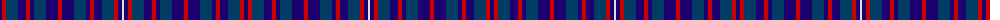

The parent of this is [Scottish North American Business Council](/tartans/db/4/r4/dba12/db8/r4/db4/dba12/db12/r4/db12/dba12/db4/r4/db8/dba12/r4/db4/ln/2/)

This was sourced from register-of-tartans.  It is a [18 stripes tartan](/stripes/stripes18/).

Original link https://www.tartanregister.gov.uk/tartanDetails.aspx?ref=3735

## Thread count
DB/4 R4 DBa12 DB8 R4 DB4 DBa12 DB12 R4 DB12 DBa12 DB4 R4 DB8 DBa12 R4 DB4 LN/2

## Palette
Each colour and its ΔE from the base-6 reference it is a variant of.

| Colour | Shade | Base | ΔE (OKLab) |
|---|---|---|---|
| DB |  `#1C0070` | B  | 0.14 |
| DBa |  `#003C64` | B  | 0.07 |
| LN |  `#E0E0E0` | W  | 0.06 |
| R |  `#C80000` | R  | 0.00 |

ID: /variants/db/4/r4/dba12/db8/r4/db4/dba12/db12/r4/db12/dba12/db4/r4/db8/dba12/r4/db4/ln/2-db1c0070-dba003c64-lne0e0e0-rc80000/
