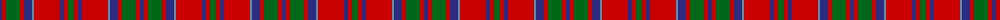

The parent of this is [MacKillop Clan Tartan Tartan Number: 512. Earliest known date: pre 2003 The MacKillops are a Sept of MacDonald of Keppoch, whose tartan this sett closely resembles. See products available Copyright © Blair Urquhart, Comrie, 2015](/tartans/db/4/r4/g14/r4/db8/b2/r26/db4/r4/g/6/)

This was sourced from house-of-tartan.  It is a [10 stripes tartan](/stripes/stripes10/).

Original link http://www.house-of-tartan.scotland.net/house/TartanViewjs.asp?colr=Def&tnam=512

## Thread count
DB/4 R4 G14 R4 DB8 B2 R26 DB4 R4 G/6

## Palette
Each colour and its ΔE from the base-6 reference it is a variant of.

| Colour | Shade | Base | ΔE (OKLab) |
|---|---|---|---|
| B |  `#5C8CA8` | B  | 0.23 |
| DB |  `#2C2C80` | B  | 0.05 |
| G |  `#006818` | G  | 0.02 |
| R |  `#C80000` | R  | 0.00 |

ID: /variants/db/4/r4/g14/r4/db8/b2/r26/db4/r4/g/6-b5c8ca8-db2c2c80-g006818-rc80000/
